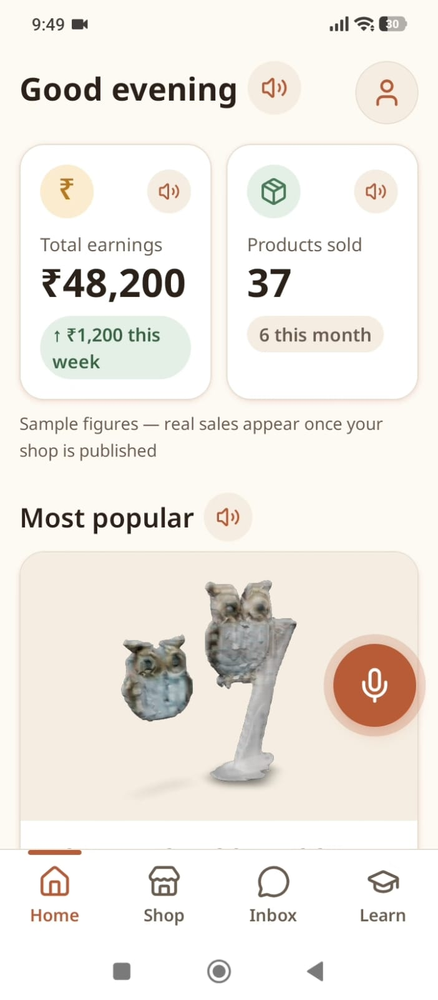

# KalaSetu

**AI-Driven Market Linkage and Smart Cataloging for Marginalized Artisans**

This repository contains the codebase and submission details for the KalaSetu project for SIH 2026.

## 1. Project Information

- **Project Title:** KalaSetu
- **PS ID:** 26090
- **PS Title:** AI-Driven Market Linkage and Smart Cataloging Mobile Application for Marginalized Artisans
- **Category:** Software
- **Theme:** Heritage & Culture

**Team Members:**

- **Vatsal Veerwal** — Machine Learning & AI Lead (2023UCB6055)
- **Srishti Ahuja** — Backend & Cloud Architecture Lead (2023UCI8047)
- **Tanisha** — Mobile App Developer (2023UCB6035)
- **Ashi Jain** — Full Stack Developer (2023UEE4075)
- **Chitranshi Sehrawat** — UI/UX Designer & Product Manager (2023UCB6064)
- **Upparapally Vasista** — Data Engineer & Integrations Lead (2023UEE4566)

<div align="center">
  
</div>

## 2. Problem Statement

Marginalized artisans struggle to list their stock on modern e-commerce platforms like ONDC due to language barriers, lack of digital literacy, and the prohibitive cost of professional cataloging and 3D modeling.

## 3. Proposed Solution

KalaSetu is a comprehensive, AI-first ecosystem designed to bridge the digital divide for marginalized artisans, empowering them to participate in the modern digital economy with zero friction. At its core, KalaSetu eliminates the need for text-based data entry and expensive professional cataloging.

An artisan simply speaks a description of their product in their native language and points their smartphone at the item. From these simple inputs, our intelligent pipeline automatically:

- **Transcribes and Translates:** Converts the spoken audio into structured digital facts.
- **Enhances and Catalogs:** Removes messy backgrounds, creates studio-quality 2D images, and even generates interactive 3D product mockups.
- **Analyzes and Prices:** Assesses the craft's complexity and current market trends to recommend a fair, competitive price.
- **Publishes:** Pushes a fully formed, professional listing directly to the ONDC network and government marketplaces.

By offering a strictly zero-text interface (via "Sakhi Mode") and an integrated AI business coach that provides actionable nudges, KalaSetu not only digitizes inventory but actively upskills the artisan. This solution transforms a daunting digital onboarding process into a natural, conversational experience, giving rural creators the exact same e-commerce superpowers as large urban retailers.

## 4. Key Features

- **Artisan Profile & Auth:** Secure OTP and PIN-based login with isolated tenant storage.
- **AI Image Enhancer & Studio:** Automatic background removal and image enhancement.
- **Multilingual Auto-Cataloger:** Speech-to-text transcription combined with AI fact extraction to auto-fill listing details.
- **Dynamic Pricing Assistant:** Recommends fair pricing based on extracted product facts.
- **Business Coach:** Provides actionable business insights, nudges, and mockups.
- **Sakhi Mode (Zero-Text UI):** Allows field workers (Sakhis) to manage multiple artisans seamlessly without a text-heavy interface.
- **3D Product Preview:** Generates 3D models (GLB format) from 2D product photos.
- **Craft Identification & GI Tagging:** AI detection of traditional craft motifs mapped to Geographical Indications.
- **Video-to-Catalog:** Automatically generating product listings from a video walkthrough.
- **WhatsApp Channel Integration:** Allowing buyers and artisans to converse seamlessly via WhatsApp using an intelligent agent.
- **ONDC & GeM Publisher:** True one-click publishing of catalog items to the ONDC network and GeM portal.
- **RAG Query Engine:** Robust buyer query answering grounded in product facts and artisan stories.

## 5. Technology Stack

- **Frontend:** React Native (Expo)
- **Backend API:** Python, FastAPI
- **Database:** PostgreSQL (Neon with `pgvector` for embeddings)
- **Machine Learning Services:** FastAPI (dedicated ML service for TripoSR/Trellis 3D generation and background removal)
- **LLMs:** Gemini, Groq (for transcription and text completion)
- **Storage:** Local / Cloudflare R2 / Cloudinary

## 6. Architecture

See [docs/architecture.md](docs/architecture.md).

```text
Mobile App
  |
  v
Backend API (FastAPI)
  |--- (File Uploads) ---> Storage (R2/Cloudinary)
  |--- (Prompts) --------> LLM (Gemini/Groq)
  |--- (HTTP Requests) --> ML Service (3D Gen, BG Removal)
  |
  +----> Database (Neon Postgres + pgvector)
```

## 7. Repository Structure

```text
KALASETU/
├── README.md
├── SUBMISSION_GUIDE.md
├── submission/
│   ├── PRESENTATION.md
│   └── DEMO.md
├── src/
│   ├── apps/
│   │   ├── api/
│   │   ├── ml/
│   │   └── mobile/
│   ├── docs/
│   └── infra/
├── docs/
│   └── architecture.md
├── assets/
│   └── screenshots/
│       └── README.md
├── .gitignore
└── LICENSE
```

### What goes where?

| Item                                   | Location              |
| -------------------------------------- | --------------------- |
| Source code                            | `src/`                |
| Architecture / technical documentation | `docs/`               |
| Project screenshots / hardware photos  | `assets/screenshots/` |
| Final PPT / presentation               | `submission/`         |
| Demo video link                        | `submission/DEMO.md`  |
| Project overview                       | `README.md`           |

## 8. Final Presentation

Keep your final SIH presentation in the repository whenever the file size allows it.

See [submission/PRESENTATION.md](submission/PRESENTATION.md) for the required format.

If the PPT is too large for GitHub, use Google Drive/OneDrive and put the accessible viewer link in `submission/PRESENTATION.md`.

## 9. Demo Video

A demo video is **optional**, but recommended.

Add the YouTube/Google Drive link in [submission/DEMO.md](submission/DEMO.md).

## 10. Screenshots / Prototype Photos

Add important screenshots or hardware/prototype photos to:

`assets/screenshots/`

See [assets/screenshots/README.md](assets/screenshots/README.md) for examples and naming conventions.

## 11. Installation

**Database setup:**

```bash
cd src/apps/api
cp .env.example .env
# Fill in DATABASE_URL using the postgresql+asyncpg:// scheme
make migrate
```

**Mobile App setup:**

```bash
cd src/apps/mobile
cp .env.example .env
# Set EXPO_PUBLIC_API_URL to your machine's LAN IP address
npm install
```

## 12. Run

**Run the Backend API & ML Service:**

```bash
# In terminal 1 (Backend API)
cd src/apps/api
uvicorn app.main:app --host 0.0.0.0 --port 8000 --reload

# In terminal 2 (ML Service)
cd src/apps/ml
uvicorn app:app --host 0.0.0.0 --port 8001 --reload
```

**Run the Mobile App:**

```bash
# In terminal 3 (Mobile App)
cd src/apps/mobile
npm start
```

_Scan the QR code in the Expo Go app._

**Pre-compiled Demo APK:**
A pre-compiled Android APK is available for direct installation and testing on physical Android devices.
- **APK Download:** [Download from Google Drive](https://drive.google.com/drive/folders/1UaDwAhZKv8kVGn1z7W9G1vS0l2GPFAMc?usp=sharing)

## 13. Future Scope

Our future roadmap includes implementing several optional features to further empower artisans:

- **Artisan Story Card:** Auto-generating a printable branding template with the artisan's photo, village, craft, and a transcribed voice-note story attached to every listing to convert buyers of handmade goods.
- **Credit Report PDF:** Automatically compiling formal income statements based on digital sales to make marginalized artisans visible to formal credit and MUDRA loan applications.
- **Graduation Mode (Dynamic AI Assistance):** Gradually reducing the level of AI assistance (from full AI generation to guided review) as an artisan's digital literacy improves with platform usage.

## Important

Before submission, make sure the repository is accessible to reviewers. Do **not** upload passwords, API keys, access tokens, `.env` files containing secrets, or other confidential credentials.
