# KalaSetu Screenshots

This directory contains screenshots of the KalaSetu mobile application showcasing the user journey from login to 3D rendering and Sakhi management.

### App Workflow

1. **Login:** 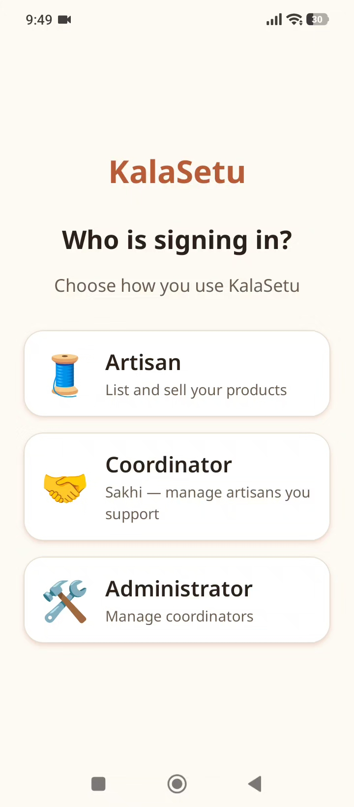
2. **Dashboard:** 
3. **Capture Photo:** 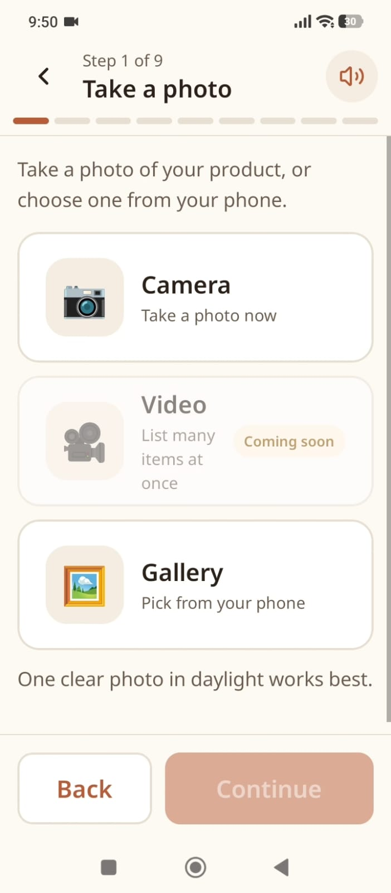
4. **Additional Angles:** 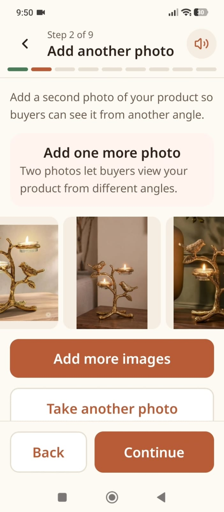
5. **AI Enhancement:** 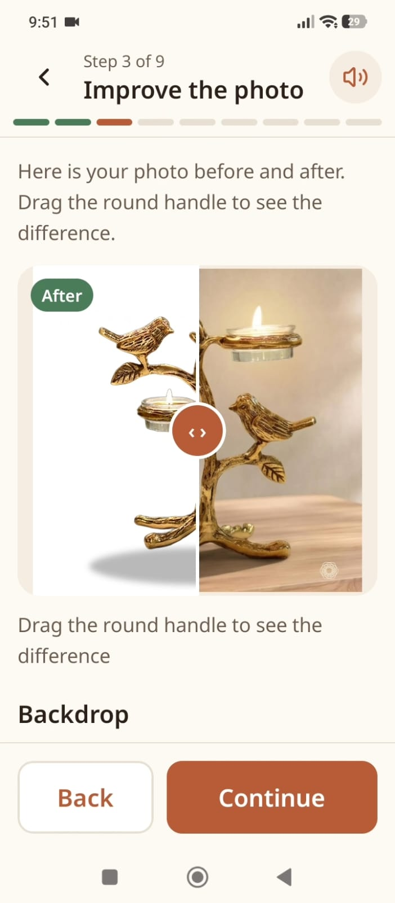
6. **Voice Details:** 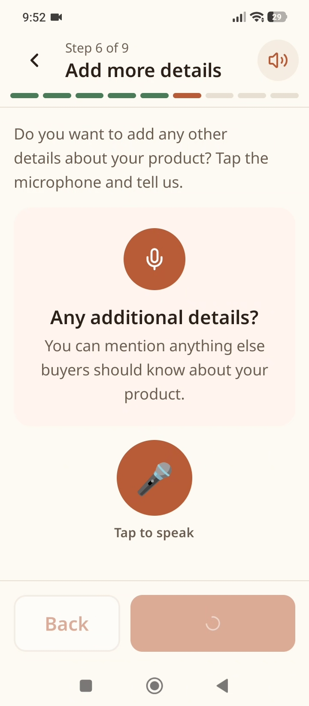
7. **Pricing Estimator:** 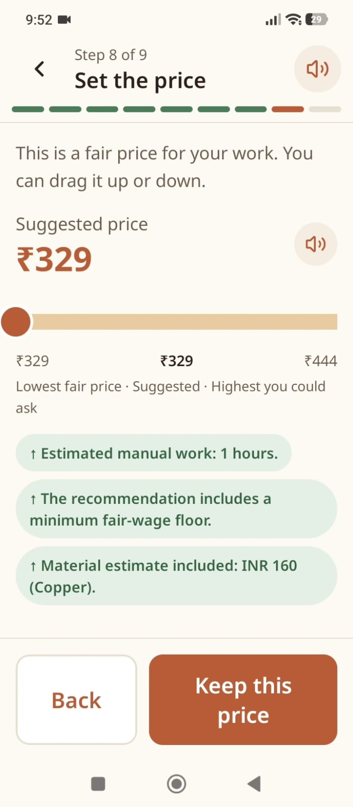
8. **Live Listing Dashboard:** 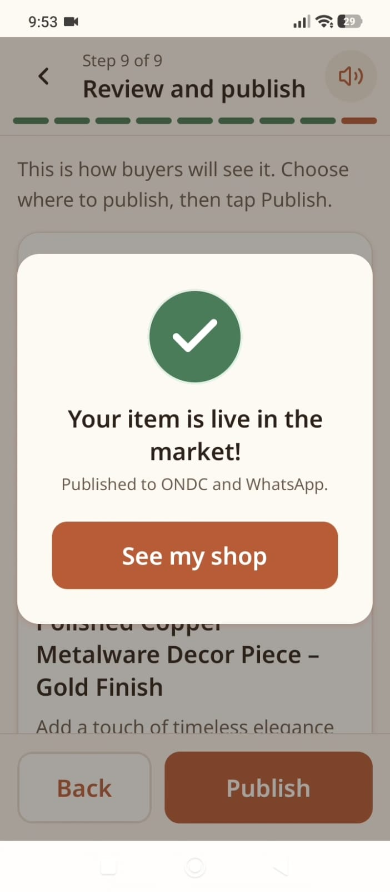
9. **Listing View:** 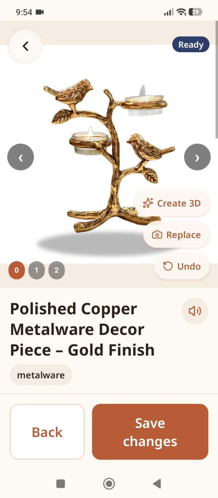
10. **3D Interactive Model:** 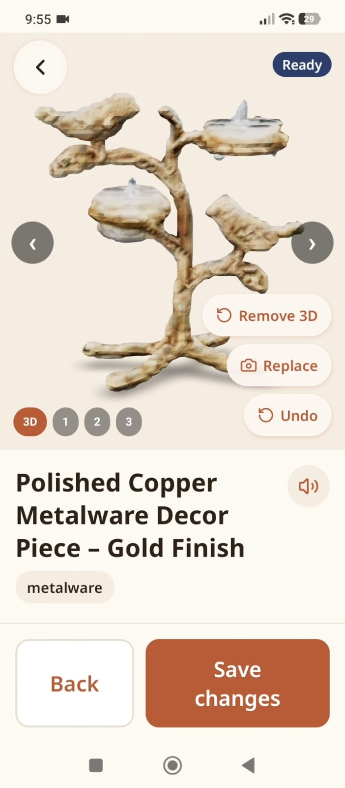
11. **Manage Artisans (Sakhi):** 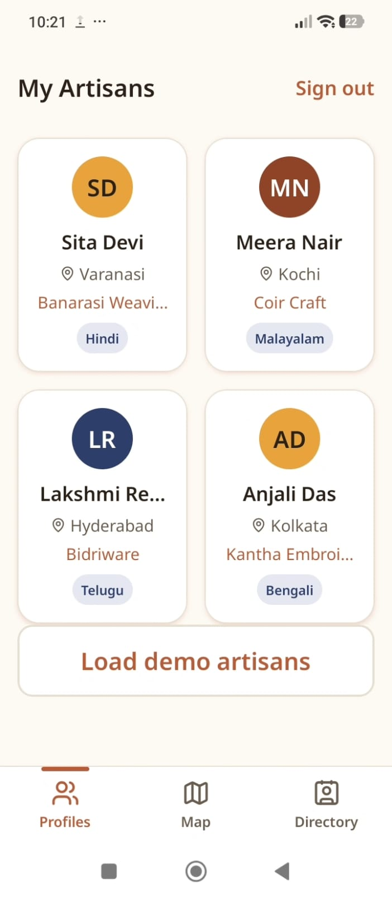
12. **Sakhi Map:** 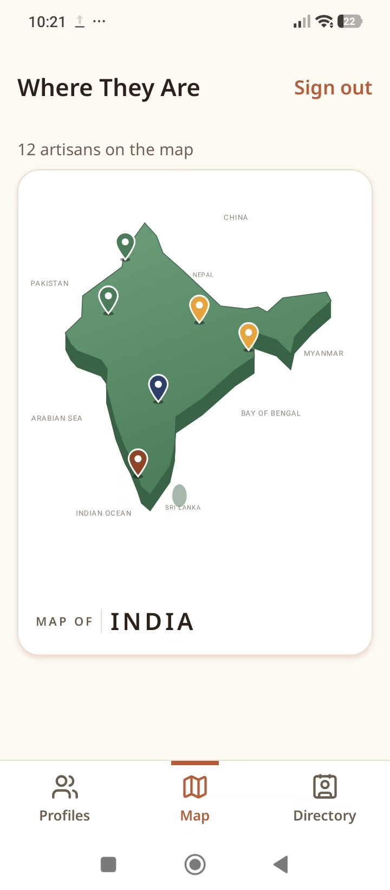
13. **Sakhi Directory:** 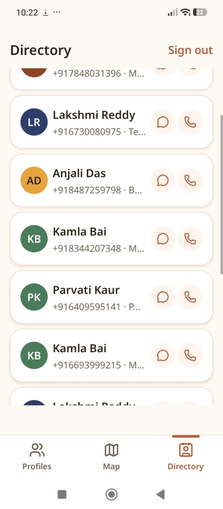
